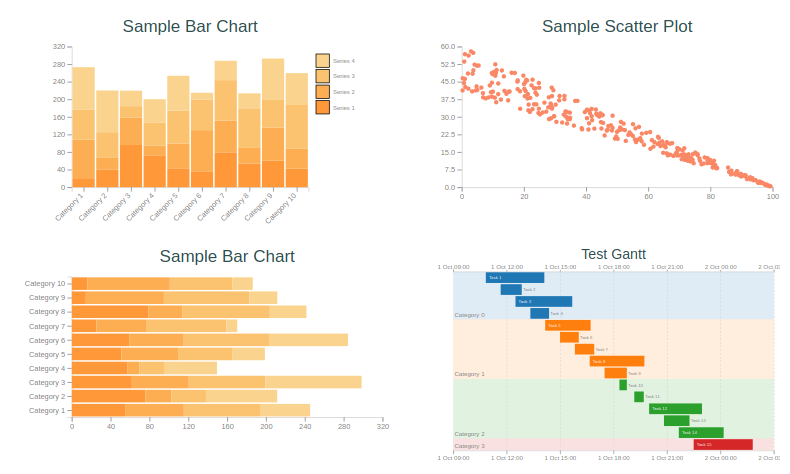

# ContEx

ContEx is a simple server side charting package for elixir.



... and it works nicely in Phoenix LiveView


## Core concepts

### Dataset 
ContEx uses a simple `Dataset` structure - a list of lists or a list of tuples together with a list of column names.

For example:
```elixir
 data = [{1, 1}, {2, 2}]
 ds = Dataset.new(data, ["x", "y"])
```

### Charts
Data can be represented within different chart types. Currently supported charts are `BarChart`, `PointPlot`, `GanttChart` and `Sparkline`. Generally speaking, you can create a chart structure by calling `new(<DataSet>)` on the relevant module and Contex will take a reasonable guess at what you want. For example:

```elixir
point_plot = PointPlot.new(ds)
```

Will make a new point plot with the first column used for the x-axis, the second for the y-axis, and the scales set to look ok.

Each module has different option. For example, `BarChart` allows you to set the `padding()` between the bar groups, specify whether you want `type()` to be `:grouped` or `:stacked`.

Each chart type implements the `PlotContent` protocol which requires it to scale to a defined height and width, emit SVG and optionally emit SVG for a legend. Generally, you won't directly access this protocol however, because...

### Plots
... Charts live within a `Plot`. `Plot`s manage things like titles, margins, axis titles, legend placement etc.

So to generate SVG ready for your web-page you would do something like:

```elixir
plot = Plot.new(600, 400, point_plot)
 |> Plot.plot_options(%{legend_setting: :legend_right})
 |> Plot.titles("My first plot", "With a fancy subtitle")

Plot.to_svg(plot) 
#^ This generates something like {:safe, "<svg> fancy SVG chart rendering stuff representing your plot</svg>"}
``` 

### Scales
Scales are all about mapping attributes to plotting geometry. They handle transformation of data to screen coordinates (and other plotting attributes). They also handle calculation of tick intervals and the like where appropriate. Scales currently implemented are:

- `ContinuousLinearScale` : A linear continuous scale
- `OrdinalScale` : For categories / discrete attributes. Used for plotting the category axis in a `BarChart`.
- `CategoryColourScale` : Maps unique attributes into colours
- `TimeScale` : A continuous timescale for `DateTime` and `NaiveDateTime` data types

Others under consideration:
 - `ContinuousLogScale` : A log version of continuous scale
 - `ContinuousColourScale` : Generate colour gradients


### Legends
`Legend`s are generated for scales. Currently legend generation is only supported for a `CategoryColourScale`

### WARNING
There are quite a few things to tidy up to make this ready for the real world, and the API is likely to be unstable for a little while yet...

- [x] Reasonable docs - the best resource currently is the accompanying [demo project](https://github.com/mindok/contex-samples)
- [ ] Default styling
- [ ] Upgrade Elixir required version to 1.10 and fix up some of the data comparison operators to use the new sort capabilities. Holding off on this for a while so we don't force an unwanted Elixir upgrade.
- [x] Multiple series in point plot
- [ ] Line plot (probably option in point plot)
- [x] Some test coverage - it has been built interactively using a liveview page for testing / refinement. Thanks to @srowley for getting some test coverage in place.
- [ ] More test coverage... An approach for comparing "blessed" output SVG would make sense, including handling minor difference in spacing or element attribute order.
- [ ] Options handling - needs to be better structured and use keyword lists rather than maps
- [ ] Colour handling
- [ ] Plot overlays (e.g. line chart on bar chart)
- [x] SVG generation is poorly structured - lots of string interpolation. 
- [ ] Benchmarks - particularly for the situation where large datasets are getting updated frequently and served via LiveViews.


## Installation

The package can be installed
by adding `contex` to your list of dependencies in `mix.exs`:

```elixir
def deps do
  [
    {:contex, "~> 0.1.0"}
  ]
end
```

## Prior Art, Related Material & Alternatives
Various details relating to scales, axes and SVG layout have been learnt from the excellent [D3](https://d3js.org/) library by [Mike Bostock](https://github.com/mbostock).

The theory of translating data into graphics is also very well handled by [ggplot2](https://ggplot2.tidyverse.org/) and various papers by Hadley Wickham, such as [A Layered Grammar of Graphics](http://vita.had.co.nz/papers/layered-grammar.pdf)

_Pure Elixir Alternatives_

- [PlotEx](https://github.com/elcritch/plotex) - has good line & time-series support and more optimised for certain situations.
- [Sasa Juric Homebrew](https://github.com/sasa1977/demo_system/) - graph.html.leex has examples of injecting data into SVGs for very specific use cases. 


