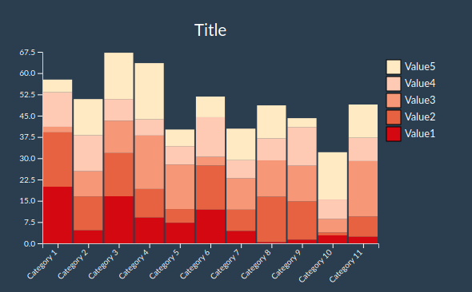

# Contex

Contex is a simple server side charting package for elixir.



## Core concepts

### Dataset 
Contex uses a simple `Dataset` structure - a list of lists or a list of tuples together with a list of column names.

For example:
```elixir
 data = [{1, 1}, {2, 2}]
 ds = Dataset.new(data, ["x", "y"])
```

### Charts
Data can be represented within different chart types. Currently supported charts are `BarPlot`, `PointPlot`, `GanttChart` and `Sparkline`. Generally speaking, you can create a chart structure by calling `new(<DataSet>)` on the relevant module and Contex will take a reasonable guess at what you want. For example:

```elixir
point_plot = PointPlot.new(100, 100, ds)
```

Will make a new point plot with the first column used for the x-axis, the second for the y-axis, and the scales set to look ok.

Each module has different option. For example, `BarPlot` allows you to set the `padding()` between the bar groups, specify whether you want `type()` to be `:grouped` or `:stacked`.

Each chart type implements the `PlotContent` protocol which requires it to scale to a defined height and width, emit SVG and optionally emit SVG for a legend. Generally, you won't directly access this protocol however, because...

### Plots
... Charts live within a `Plot`. `Plot`s manage things like titles, margins, axis titles, legend placement etc.

So to generate SVG ready for your web-page you would do something like:

```elixir
plot = Plot(600, 400, point_plot)
 |> Plot.plot_options(%{legend_setting: :legend_right})
 |> Plot.titles("My first plot", "With a fancy subtitle")

Plot.to_svg(plot) 
#^ This generates something like {:safe, "<svg> fancy SVG chart rendering stuff representing your plot</svg>"}
``` 

### Scales
Scales are all about mapping attributes to plotting geometry. They handle transformation of data to screen coordinates (and other plotting attributes). They also handle calculation of tick intervals and the like where appropriate. Scales currently implemented are:

- `ContinuousScale` : A linear continuous scale
- `OrdinalScale` : For categories / discrete attributes. Used for plotting the category axis in a `BarPlot`.
- `CategoryColourScale` : Maps unique attributes into colours
- `TimeScale` : A continuous timescale for `DateTime` and `NaiveDateTime` data types

Others under consideration:
 - `ContinuousLogScale` : A log version of continuous scale
 - `ContinuousColourScale` : Generate colour gradients


### Legends
`Legends` are generated for scales. Currently legend generation is only supported for a `CategoryColourScale`

### WARNING
There are quite a few things to tidy up to make this ready for the real world:

[ ] Reasonable docs
[ ] Default styling
[ ] More test coverage - it has been built interactively using a liveview page for testing / refinement
[ ] Options handling - needs to be better structured and use keyword lists rather than maps
[ ] Colour handling
[ ] SVG generation is poorly structured - lots of string interpolation. A DSL would be a lot nicer, or something like the approach in [Chunky SVG](https://github.com/mmmries/chunky_svg/), which in turn uses [XML Builder](https://github.com/joshnuss/xml_builder), but this needs a bit of thought to maintain performance and memory efficiency. XML Builder has implemented the XML generation using IO Lists.
[ ] Benchmarks - particularly for the situation where large datasets are getting updated frequently and served via LiveViews.


## Installation

The package can be installed
by adding `contex` to your list of dependencies in `mix.exs`:

```elixir
def deps do
  [
    {:contex, "~> 0.1.0"}
  ]
end
```


